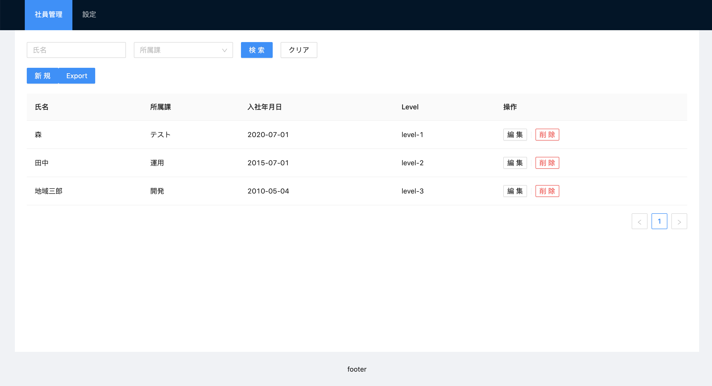
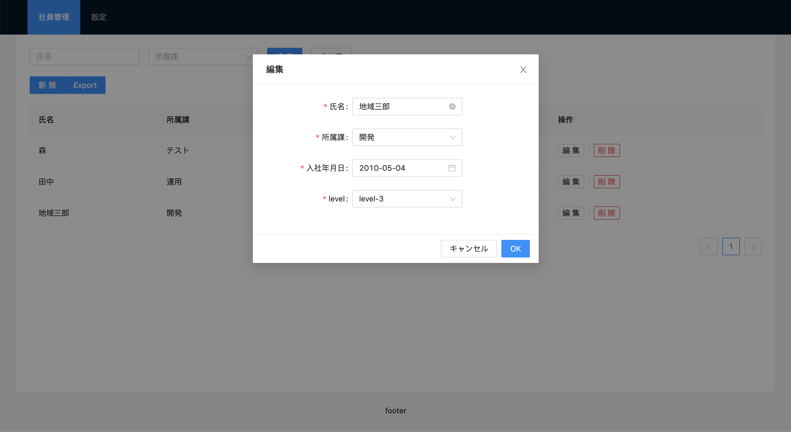

# HRM - employee management system(CRUD)

The purpose of this project is to discover an implementation of an **APIRESTfull** + **Client** using TypeScript.

- API Server:express with sqliteDB
- Client:React(Hooks) with Redux & AntD

# Usage

## Setup Server

```
$ cd server-express
($ npm install)
$ npm run build
$ npm start (npm run watch)
```

## Setup Client

```
$ cd hrm-client
($ npm install)
$ npm start
```

# View Copy



